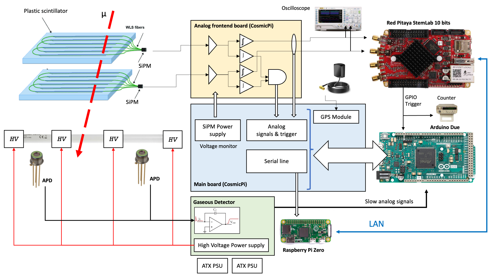

  
  
Educational homemade cosmic muon telescope based on plastic scintillators, SiPMs and gaseous detector 

<b>Author: Valerio Pagliarino </b> 

# Description
  
This project is about a homemade telescope for detecting muons from secondary cosmic rays. It is made of a couple of tiles of plastic scintillator material containing a transparent optical fiber for photon collection; this fiber is coupled to a silicon photomultipliers (SiPM) sensor. 

      
The two tiles are installed on a servomechanism that allows to change the orientation and can be used as a trigger source for a gaseous detector. The electronics is divided in two part:
      - The slow control electronics consisting in microcontroller-based boards and a main board coming from the CERN Cosmic Pi kit that is able to generate high voltage for SiPM biasing and a Raspberry Pi 0.
      - The fast control electronics consisting in a signal conditioning board coming from the CERN Cosmic Pi kit, a broadband amplifier board and finally a Red Pitaya (based on Zynq7010) board used as DAQ system.
      
The CERN Cosmic Pi main board contains also a GPS receiver that can be used for providing the events with an accurate timestamp. The GPS is connected to a receiver module hosted on the main board, which is connected to an Arduino Due (32 bit MCU board) that communicates with a Raspberry Pi Zero via a serial interface.

Under the two scintillator plates is located a homemade-gaseous detector with a photodiode readout. (Please see the links below for additional details.) The photodiodes are connected to the analog inputs of the Arduino Due module.

The syncronization between the 'fast readout' of the scintillators using the Red Pitaya board and the readout of the gaseous detector is possible because the output of the frontend analog board responsible for the scintillator (SiPMs) readout is connected to a main board and then to the Arduino Due, but at the same time is connected to the RF inputs of the Red Pitaya board. Furthermore, an additional slower aux trigger signal is produced by the Red Pitaya DAQ system (GPIO output) when the acquisition is triggered.

      
## Documents & Sources
  
  - [General description](./docs/description.md)
  - [Electronic schematics](./docs/electronics.md)
  - [Firmware](./docs/firmware.md)
  - [Frontend and analysis software (Python)](./docs/frontend.md)

  

## Copyright and acknowledgements
  
You can freely reuse part of this project, but reference to the author is appreciated. This work has been supported by the "Red Pitaya" company that provided the STEMlab 125-10 board for free. Thank you very much!

## Photos and videos
  
 

  

  - [Plastic Scintillator Detectors](./docs/images/PlasticScintDet.JPG)
  - [Scintillators + SiPM analog electronics](./docs/images/PlasticScintAnalog.JPG)
  - [Scintillator robotic holder](./docs/images/PlasticScintHolder.JPG)
  - [RedPitaya Readout](./docs/images/RedPitaya.JPG)
  - [Typical scintillator + SiPM + shaping amplifier signal waveform with coincidence](./data/Pulse_shaper_output_scope/DS1Z_QuickPrint19.png)
  - [Video presentation](https://drive.google.com/file/d/1HAYBrgGeV7JeQhQqhtkxtIOAlfAdhUKZ/view?usp=share_link)

## Useful documents for further developments

### Particle detectors
- Introduction to SiPM for cosmic rays detection (http://cold.oact.inaf.it/cold/index.php/en/detectors/sipm-en)
- Cosmic ray detection with plastic scintillators (https://physicsopenlab.org/2016/01/04/scintillation-muons-detector/)
- SiPM coupled to plastic scintillators (https://physicsopenlab.org/2016/03/31/sipm-plastic-scintillator/)

### Hardware
- Simple Frontend electronics for SiPM (https://physicsopenlab.org/2017/11/28/front-end-electronics-for-sipm/)
- CERN Cosmic Pi GitLab Repository (https://ohwr.org/project/cosmic-pi/wikis/home)
- CERN Cosmic Pi Schematic Design Review - Open to all (http://cosmicpi.org/blog/2016/07/05/schematic-design-review-open-to-all.html)
- Red Pitaya public schematics (https://downloads.redpitaya.com/doc/Red_Pitaya_Schematics_STEM_125-10_V1.0.pdf)

### Firmware
- CERN Cosmic Pi 32 bit MCU Firmware (https://github.com/CosmicPi/CosmicPiFirmware1point7)
- Build FPGA image for Red Pitaya (https://redpitaya.readthedocs.io/en/latest/developerGuide/software/build/fpga/fpga.html)
- Red Pitaya / FPGA Resources (https://lniv.fe.uni-lj.si/redpitaya/)
- Red Pitaya FPGA Firmware Repository (https://github.com/RedPitaya/RedPitaya-FPGA)

### Software
- Red Pitaya Jupyter Notebook Python interface (https://redpitaya.com/applications-measurement-tool/jupyter-notebook-python/)

  

