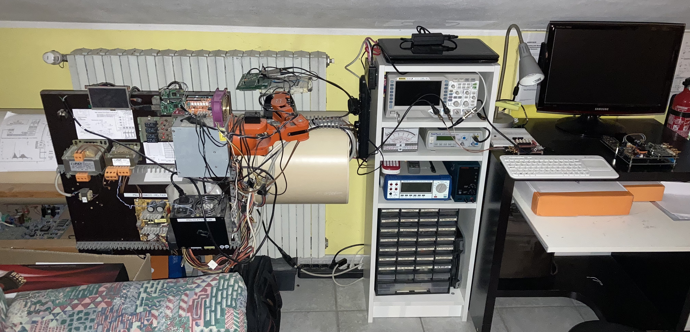

  
  
Educational homemade cosmic muon telescope based on plastic scintillators, SiPMs and gaseous detector 

  <b>Author: Valerio Pagliarino </b> 

# Description
  
This project is about a homemade telescope for detecting muons from secondary cosmic rays. It is made of a couple of tiles of plastic scintillator material containing a transparent optical fiber for photon collection; this fiber is coupled to a silicon photomultipliers (SiPM) sensor. 

      
The two tiles are installed on a servomechanism that allows to change the orientation and can be used as a trigger source for a gaseous detector. The electronics is divided in two part:
      - The slow control electronics consisting in microcontroller-based boards and a main board coming from the CERN Cosmic Pi kit that is able to generate high voltage for SiPM biasing and a Raspberry Pi 0.
      - The fast control electronics consisting in a signal conditioning board coming from the CERN Cosmic Pi kit, a broadband amplifier board and finally a Red Pitaya (based on Zynq7010) board used as DAQ system.
      
The CERN Cosmic Pi main board contains also a GPS receiver that can be used for providing the events with an accurate timestamp.
      
## Documents
  
  - [General description](./docs/description.md)
  - [Electronic schematics](./docs/electronics.md)
  - [Firmware](./docs/firmware.md)
  - [Frontend and analysis software (Python)](./docs/frontend.md)

## Photos and videos
  
 

  
  
## Copyright and acknowledgements
  
You can freely reuse part of this project, but reference to the author is appreciated. This work has been supported by the "Red Pitaya" company that provided the STEMlab 125-10 board for free. Thank you very much!

