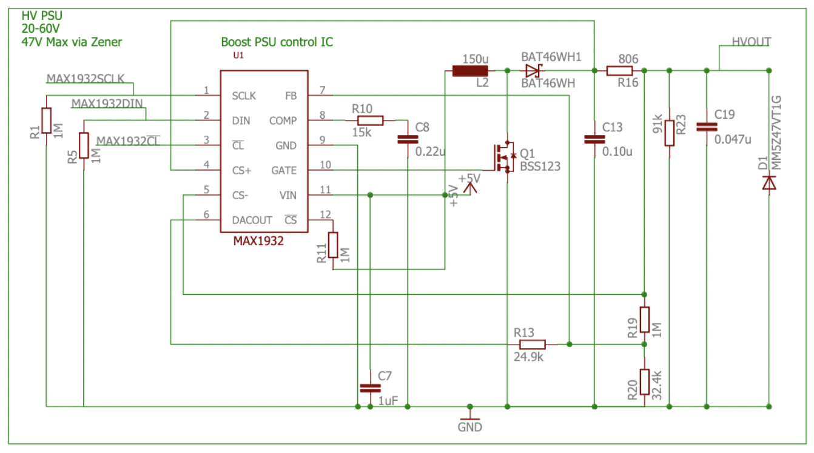
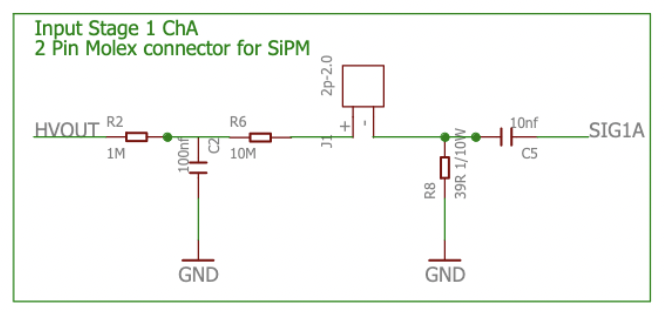
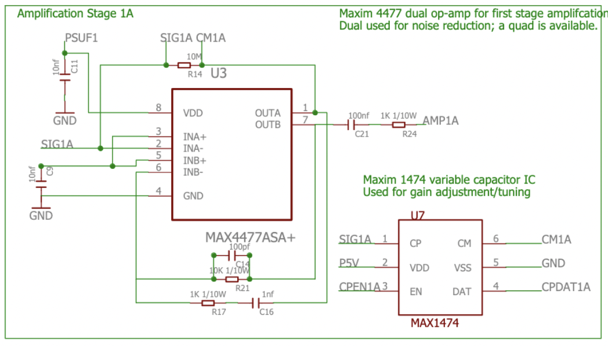
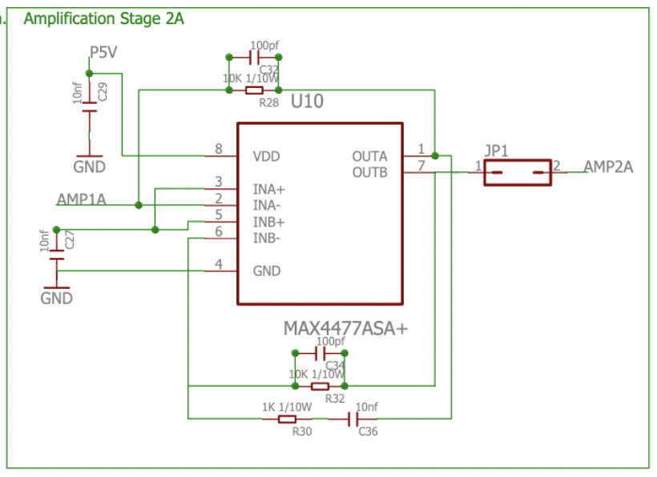
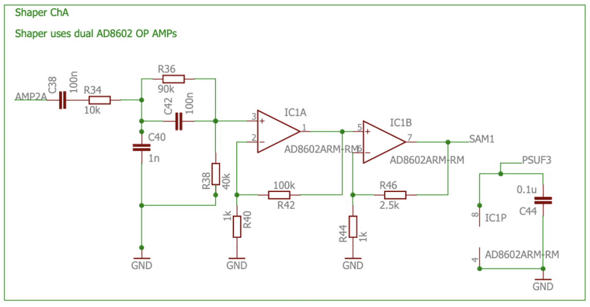
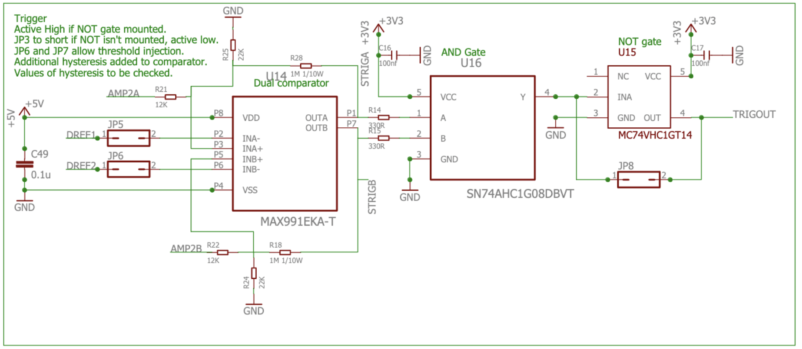
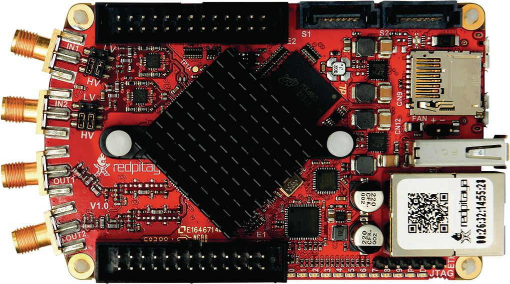
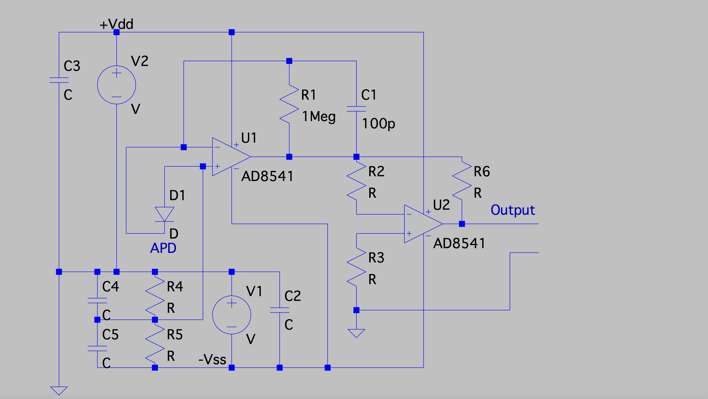

# Electronics

The SiPM readout circuit is based on the design from CERN for the Cosmic Pi project: their preamplification and signal shaping board and main board with Arduino Due interface are used. The full schematics are available in the repository at the following links:

https://ohwr.org/project/cosmic-pi/wikis/Documents/New-Main-Schematic---Design-Review

https://ohwr.org/project/cosmic-pi/uploads/e180f2ec4a1d663d921ca5832ff20e9a/cosmicpischematic03.pdf

The schematic is distributed under the CERN OHL 1.2 Open Hardware License.

In the next few paragraphs only the most significative details are reported.

## High voltage power supply

 

  

The Silicon Photomultipliers need a DC biasing voltage in the order of 25 - 65 V, the value depends on the specific SiPM model. In our case the biasing voltage is set using a Zener diode to 47 V DC. 
Considering that the main board is powered by a 5V 5A power supply, a step-up DC-DC converter is needed to obtain such a voltage. An inductive boost converter based on the MAX1932 integrated circuit fits this application.

## Input stage

 

  

The input stage of the board is represented in the figure above. A 1 MOhm resistance is used as current limiter after the high voltage injection, a 100 nF capacitor is used for voltage stabilization and then another high value resistance is placed. On the SiPM cathode it is possile to see a 10 nF capacitor together with a resistor, this high-pass filter is responsible of removing the high-voltage DC component from the signal going to the amplifier.

## Amplification stage

Each channel of the board (that supports 2 independent SiPMs) has a two stage amplifier:

First stage:
 

  

Second stage:
 

  

Both the amplification stages are based on the MAX4477ASA+ operational amplifier that enables single-supply operation at 5 V, with Gain-Bandwidth product of 42 MHz. The Maxim 1474 variable capacitor IC is used for gain adjustment.

## Shaper

 

  

After the two amplification stages, a dual stage shaper based on the AD8602 operational amplifiers has the role of shaping the output signal to match a proper timing for waveform digitization. In the original design the output signal of the shaper was connected to the analog input of an Arduino Due board, but in our case the SAM1 signal is routed to the RF input of a <b>Red Pitaya 10 bit</b> DAQ board.

## Trigger

 

  

The board has an on-board trigger circuit with logic ports for coincidence between the two scintillator detectors. The trigger is based on the dual channel comparator MAX991EKA-T followed by the logic AND port SN74AHC1G08DBVT and, finally, by a logic inverter. The output signal is connected to the digital input of a counter and to an input of the Arduino Due board. 

## Red Pitaya 10 bit DAQ

 

  

  The two analog output signal coming from the active shapers (SAM1 and SAM2) are connected using 100 MHz 1X SMA probes to the two RF inputs of a Red Pitaya Stemlab 125-10 with the two analog input configured using the jumper to work within the (-1V,+1V) range. (The signal is expected to be inside the (-100 mV, +300 mV) range). The signal can be acquired using a threshold trigger on the first scintillator, and the coincidence trigger can be implemented in software by analysing the acquired waveforms. A pulse on a digital output pin can be generated by the software running on the Red Pitaya module for incrementing and external counter. More details in the software section. Other possible configurations include the possibility to use a digital input pin for checking the stage of the hardware trigger coincidence signal generated by the AND gate following the MAX991EKA-T hardware discriminator. In this case, a single scintillator channel can be acquired with the Red Pitaya board and the free RF input can be used for the readout of the "sum channel" of the APDs employed in the gaseous detector.

## Gaseous detector readout

Two different configurations for the optical gaseous detector readout have been investigated:
- A CMOS camera connected via USB to the Red Pitaya board, managed by the Linux Operative System (with low resolution, considering the limited computing resources available on the Xilinx XC7Z010 SoC). This solution was not successful.
- An array of avalanche photodiodes with a custom designed very simple readout board (it is located inside the big white cover tube), connected to an analog input of the Arduino Due board. This board can read this input with the proper timing, being connected also to the TRIGOUT signal (please see the schematic above). This solution was selected. In the following figure a sketch of the design concept of the APD readout board is presented.

 

  

The high voltage for generating the high electric field on the gas tube is obtained by using a 230V -> 12V AC transformer followed by a bridge rectifier with two 3600 uF capacitors, a current limiter and finally a capacitive voltage multiplier that is hosted on a board located inside the big  white cover tube. The dual rail power supply is generated adding a low pass filter after the +/- 12 VDC rails of a switching ATX Power Supply.

