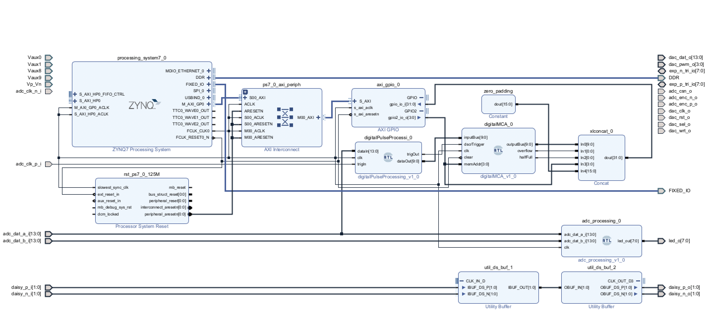

# Firmware

Currently the online Digital Signal Processing and Multi Channel Analyzer features are implemented in the Data AcQuisition (DAQ) Python software using the scipy and numpy libraries and the Red Pitaya default Oscilloscope Overlay. This is suitable for cosmic muons detection at ground level because of the very low particle rate through the detector. However, it would be nice, in future, to extend the capability of this detector to work with higher particle interaction rates. In this case it is needed to move some key Digital Signal Processing algorithms and the Multi Channel Analyzer from the software to the firmware. In this section of the project, that <b>is to be considered in "work in progress" status,</b> this porting is described. First of all, the hardware implementation and debug of algorithm is far less trivial than in software. It is done starting from a Vivado base project implementing the proper hardware constraints, (useful details and sources can be found in this blog http://antonpotocnik.com/?p=489265 and in the RedPitaya GitHub Repositories: https://github.com/RedPitaya/RedPitaya-FPGA).
The samples coming from the ADC parallel output, when the ADC is triggered, are passed to the `DigitalPulseProcessing` IP, that is responsible of the initial filtering and numerical integration. Then, the integral value is passed to the `digitalMCA` IP and finally the AXI-Lite interface is used to read sequentially the number of counts of each channel.

 

  

## FPGA Digital Pulse Processing

This IP is responsible for ADC threshold discrimination, signal filtering and integration.
The following modules are available:
- `Threshold filter with hysteresis`
- `Trapezoid filter`
- `FIR low pass filter`
- `Moving-average filter`
- `Baseline removal`
- `Numerical integration`

## FPGA Multi Channel Analyzer

This module is responsible for filling a proper histogram with the value coming from the integral output of the previous IP block.

## AXI Interface

The AXI-Lite interface is used to transfer the address of the required bin from the CPU to the MCA block and then to return to the CPU the number of counts, in this way it is possible to read sequentially all the MCA channels.